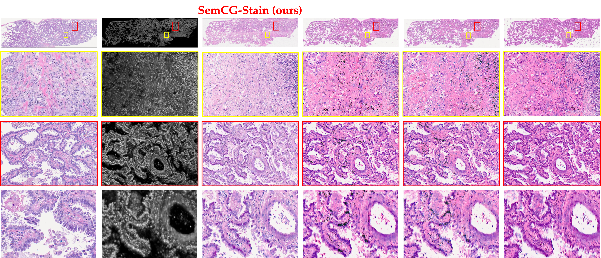

<div align="center">

# [MICCAI 2025] Pathology-aware Virtual H\&E Staining of Section-free Thick Tissues with Semantic Contrastive Guidance</div>
This is the official repository of "[Pathology-aware Virtual H&E Staining of Section-free Thick Tissues with Semantic Contrastive Guidance](https://papers.miccai.org/miccai-2025/0674-Paper5132.html)," presented at **MICCAI 2025**.
> **Pathology-aware Virtual H\&E Staining of Section-free Thick Tissues with Semantic Contrastive Guidance** <br>
> [Jintaek OH](mailto:johaa@connect.ust.hk), Lulin Shi, Terence T. W. Wong <br>
> The Hong Kong University of Science and Technology (HKUST)&nbsp;&nbsp; <br>
>
> **Abstract.** The conventional histopathology paradigm, while remaining the gold standard for clinical diagnosis, is inherently constrained by its lengthy processing time. The emergence of virtual staining in computational histopathology has catalyzed significant research efforts toward developing rapid and chemical-free staining techniques. However, current methodologies are primarily applicable to well-prepared thin tissue sections and lack the capability to effectively process the section-free thick tissues. In this work, we present a novel approach that utilizes fluorescence light-sheet microscopy to directly image thick tissue samples, followed by image translation to generate virtually stained hematoxylin and eosin (H&E) images. To overcome the insufficient exploration of pathological features in current methods, we introduce Semantic Contrastive Guidance (SemCG), which enforces morphological consistency between fluorescence inputs and H&E outputs. Additionally, we incorporate subtype-aware classification to enhance the discriminator’s ability to learn domain-specific pathological knowledge. Experimental results demonstrate that our proposed modules offer an advantage in generating high-quality images. We anticipate that this sectioning-free virtual staining framework will have significant potential for clinical rapid pathology applications, offering a transformative improvement to current histological workflows.

<p align="center"></p>

## Getting Started

To get started with this project, clone this repository to your local machine using the following command:

```bash
git clone https://github.com/commashy/SemCG-Stain.git
cd SemCG-Stain
```

### Requirements
Before Training the model, make sure you have the following requirements installed:

```bash
pip install -r requirements.txt
```
### Training
1. Prepare your dataset in the required format
2. Adjust the configuration files to suit your training needs
3. Run the following command to train the model:

```bash
python train.py \
  --dataroot /directorytotraindataset \
  --model semcg_stain \
  --netG semCG \
  --lr 0.00002 \
  --netD multi \
  --use_clip_contrast \
  --use_hard_neg \
  --name <name_of_trial>
```

### Testing
To evaluate the model, run the following command:

```bash
python test.py \
  --dataroot /directorytotestdataset \
  --model semcg_stain \
  --netG semCG \
  --name <name_of_trained_trial> \
  --epoch <epoch_to_test> \
  --num_test <number_of_testing_set>
```

### Datasets and Preprocessing
Please refer to the paper for more details on the datasets and preprocessing steps.
Will be updated soon.

## Results

Below shows virtual staining results using SemCG-Stain.


<!--
## Citation
If you find this repository useful, please consider citing:

``` bibtex

}
```
-->
